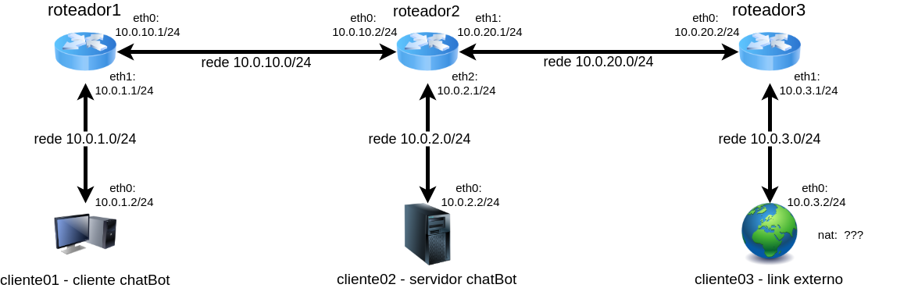

# Tutorial

## Topologia



---

### Instalação do mininet

1 - Fazer Instalação Virtual Box 5.2.2 (https://www.virtualbox.org/wiki/Download_Old_Builds_5_2)

2 - Fazer Instalação do mininet VM (https://github.com/mininet/mininet/releases)

3 - Configurar novo Host Network Manager.. no virtual box:	https://www.youtube.com/watch?v=TGmh6ppSS3M
	Criar novo hospedeiro (necessário se estiver limpo ou se ja existia um ligado a outra maquina virtual)
	Ativar servidor dhcp do novo hospedeiro

4 - Clicar com botão direito em cima da imagem do mininet

	4.1 - ir em configurações
	
	4.2 - aba redes
	
	4.3 - aba adaptador 2 
	
	4.4 - habilitar a placa de rede 
	
	4.5 - escolher placa de rede exclusiva de hospedeiro (HostOnly - ultimo número adicionado)

5 - Iniciar a maquina virtual com o mininet

#### Login VM mininet
login: mininet
password: mininet

###### Execute em root:
``` bash
$ sudo su
```
###### Configurar o ssh no VM mininet
``` bash
$ sudo dhclient eth1 # habilita ssh
```
###### Conectar via ssh na VM mininet

``` bash
$ ssh -X mininet@IP_MININET
	|	password: mininet
	|	yes
```
## Os passos a seguir podem ser executado na máquina host via ssh para a VM mininet

#### Habilitar servidor dchp nas interfaces de rede do VM mininet

``` bash
$ nano etc/network/interfaces
```
###### Adicionar o seguinte trecho no arquivo interfaces
``` bash
			auto eth0
			iface eth0 inet dhcp
			
			auto eth1
			iface eth1 inet dhcp
```
    * Ctrl + O para salvar, Enter e Ctrl+X para sair

#### clonar do github na VM mininet
``` bash
    $ sudo apt-get install git-all -y
    $ git clone https://github.com/gustavocrod/mininet-for-maxbot
    $ cd mininet-for-maxbot/
```    
###### Pode transferir via FTP [opcional]

``` bash
$ cd path/to/archives/
$ scp -scp arquivos.zip mininet@IP_MININET:~    # precisa do putty-tools

$ cd /home/mininet
$ unzip arquivos.zip
    
$ sudo apt-get update
````    
---
	
#### Instalar o python3 na VM mininet
``` bash
	$ sudo apt-get install python3-pip -y
```
###### Navegar até a pasta do projeto do max e instalar os requisitos
``` bash
$ cd mininet-to-maxbot/maxbot-master/
$ sudo pip3 install -r requirements.txt

$ sudo apt-get update && sudo apt-get install xinit flwm -y
```
	opcional:
		startx (para acessar interfaces)

#### Execução da topologia (via ssh)
``` bash
$ cd ..
$ sudo python start_topology.py
```
###### O mininet inicializará e então poderá executar o servidor do max na rede virtualizada

#### Execução do MAX bot

``` bash
mininet> xterm cliente02
mininet> xterm cliente01
```

###### No terminal do cliente02 execute:
``` bash
$ bash run_server.sh
```

###### No terminal do cliente01 execute:
``` bash
$ bash run_client.sh
```

## MAX

Veja a documentação do max clicando [aqui](https://github.com/gustavocrod/maxbot)


